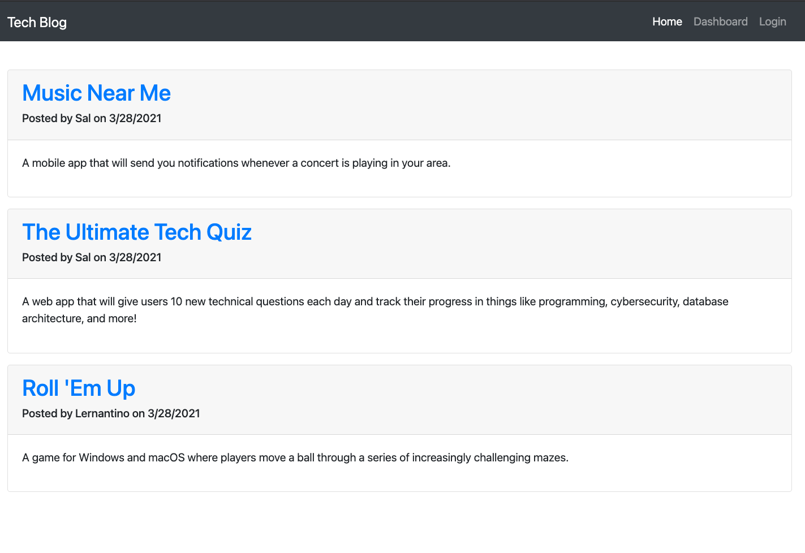

# TechBlog-MVC
CMS-style blog site similar to a Wordpress site

## Description 
  
Architect and build a CMS-style blog site similar to a Wordpress site. The app will follow the MVC paradigm in its architectural structure, using Handlebars.js as the templating language, Sequelize as the ORM, and the express-session npm package for authentication.

## Table of Contents
* [Installation](#installation)
* [Usage](#usage)
* [License](#license)
* [Questions](#questions)

## Installation

*Steps required to install project and how to get the development environment running:*

1. Download or clone repository
2. Node.js is required to run the application
3. `npm install` to install the required npm packages
4. `npm run seed` to run seed data

## Usage

* To start using the application, open your browser and go to
  
  `http://localhost:3001/`

* A live demo is available on the link below:
    * [Live Heroku App](https://techblog-utility.herokuapp.com/)

* Screenshot of the Application:

## License

MIT License

---

## Questions

* Please submit any questions at my [GitHub profile](https://github.com/grider27)

* Also, you can reach me via email @ grider27@gmail.com